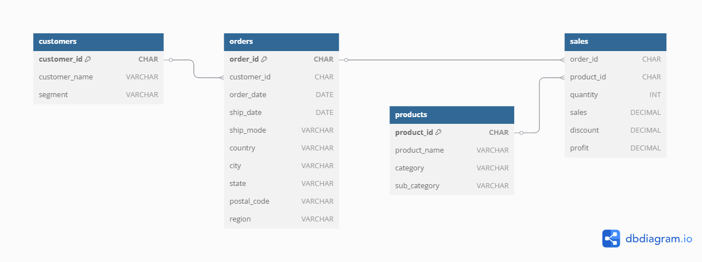

# Superstore Data Insights

About the Project
---
This project analyzes sales performance, customer behavior, product trends, and operational logistics using SQL. The dataset contains sales transactions from a fictional retail superstore, allowing us to extract valuable insights into revenue, customer segmentation, product demand, and shipping efficiency.

Dataset Overview
---
The superstore dataset consists of 9,999 rows and 21 columns, representing transactional data from a superstore. It has been cleaned and structured into four relational tables:
- customers: Contains customer details such as ID, name, and market segment.
- orders: Tracks order placement details, including dates, shipping, and location info.
- products: Lists product information, including categories and subcategories.
- sales: Records sales transactions, including revenue, quantity, discount, and profit.

Entity Relationship Diagram (ERD)
---
To understand the relationships between these tables, refer to the Entity Relationship Diagram (ERD):


Data Cleaning Process
---
Performed in Jupyter Notebook (Python - pandas, NumPy) to ensure data consistency before database creation.

✔ Removed duplicates & handled missing values
✔ Converted dates to proper format (order_date, ship_date)
✔ Standardized categorical values
✔ Split data into four normalized tables

📍 Notebook Location: data_cleaning/data_cleaning.ipynb


Key Insights & Analysis
---
1️⃣ Sales Performance & Revenue: Analyzed total sales, profit trends, and discount impact. Identified growth patterns across months, quarters, and years to optimize pricing and promotions.

2️⃣ Customer Behavior & Segmentation: Classified customers into high, medium, and low-value groups. Conducted RFM analysis to track purchasing habits, retention, and churn rates.

3️⃣ Product Performance & Market Insights: Identified best and worst-selling products, analyzed category contributions, and performed market basket analysis to uncover frequently bought-together items.

4️⃣ Operational & Logistics Efficiency: Evaluated shipping times, delays, and cost-effectiveness across shipping modes. Assessed seasonality trends to optimize logistics and delivery performance.

# Technologies Used
✔ SQL (MySQL) for data analysis
✔ CTEs & Temporary Tables for efficient queries
✔ Window Functions (DENSE_RANK, LAG, NTILE)
✔ Aggregation & Joins for relational insights
✔ Python (pandas, NumPy) for data cleaning

📂 Project Structure
---
```
📦 Superstore-Analytics
│── 📁 data/               # Contains dataset files
│    ├── README.md         # Detailed dataset description
│    ├── Superstore.csv    # Raw dataset
│
│── 📁 data_cleaning/          
│    ├── [`data_cleaning.ipynb`](data_cleaning/data_cleaning.ipynb)   # Jupyter notebooks for data cleaning
│    ├── erd_diagram.png       # ERD diagram  
│
│── 📁 queries/              # SQL scripts for analysis
│    ├── superstore_db.sql    # Creates database & tables
│    ├── analysis.sql      # SQL queries for business insights
│
│── README.md              # Project documentation (this file)
```

Sample Insights
---
Metric	Value
Total Sales Revenue	$1,200,000
Average Order Value (AOV)	$56.34
Repeat Purchase Rate	57.43%
Most Sold Product	"Product A" (5,200 units)
Most Profitable Region	East Coast


